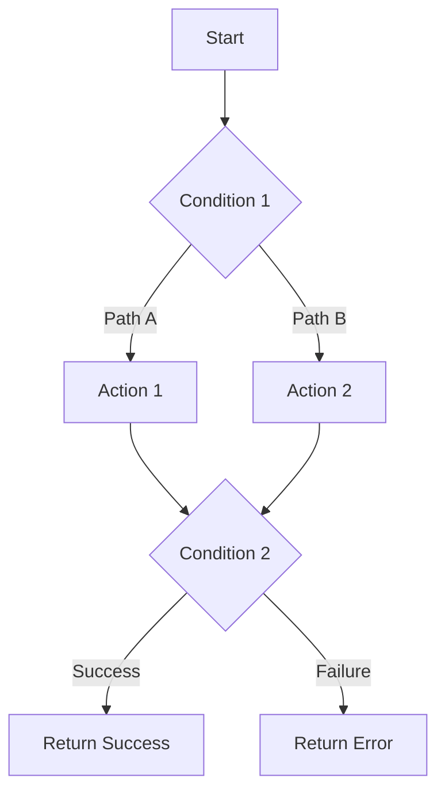

# API Specification Template

Use this template when documenting API specifications. Follow each section in order to ensure comprehensive and consistent API documentation.

---

## 1. HTTP Method & Endpoint

Clearly state the HTTP method and full endpoint path.

Example:
```
GET /api/v1/orders/{orderId}
POST /api/v1/users
PUT /api/v1/products/{productId}
DELETE /api/v1/items/{itemId}
```

---

## 2. Summary

Provide a one-sentence overview of what the API does.

Example:
- Retrieves order details for a specific order ID.
- Creates a new user account in the system.
- Updates product information for an existing product.

---

## 3. Description

Expand with 2-3 sentences explaining:
- The purpose of the API
- Primary use cases
- Any important context or prerequisites

Example:
This endpoint allows authenticated clients to retrieve detailed order information. It validates the provided order identifier and user permissions before returning the complete order details including items, pricing, and shipping information. The API supports optional filtering to include or exclude related entities such as order history and customer details.

---

## 4. Request Parameters

Document all input parameters organized by type:

### Headers

| Parameter | Type | Required | Description |
|-----------|------|----------|-------------|
| Authorization | STRING | Yes | Bearer token for authentication |
| X-Request-ID | STRING | Yes | Unique identifier for request tracing (must be valid GUID) |
| Content-Type | STRING | Yes | Media type of the request body (e.g., application/json) |
| X-API-Version | STRING | No | API version to use (defaults to latest) |

### Path Parameters

| Parameter | Type | Required | Description |
|-----------|------|----------|-------------|
| orderId | STRING | Yes | Unique identifier for the order |
| userId | STRING | No | User identifier for filtering results |

### Query Parameters

| Parameter | Type | Required | Description |
|-----------|------|----------|-------------|
| include | STRING | No | Comma-separated list of related entities to include (e.g., items,customer,shipping) |
| status | STRING | No | Filter results by status (e.g., pending, completed, cancelled) |
| page | INTEGER | No | Page number for pagination. Defaults to 1. |
| limit | INTEGER | No | Number of results per page. Defaults to 20. |

### Request Body

| Field | Type | Required | Description | Validation |
|-------|------|----------|-------------|------------|
| email | STRING | Yes | User's email address | Valid email format |
| firstName | STRING | Yes | User's first name | 2-50 characters |
| lastName | STRING | Yes | User's last name | 2-50 characters |
| phoneNumber | STRING | No | User's contact number | E.164 format |
| address | OBJECT | No | User's address details | Valid address object |

---

## 5. Request Processing Rules

Describe the step-by-step logic for how the API processes the request.

For complex flows with multiple steps, include a Mermaid diagram.

Example format:



Processing steps:

1. Step Name
   - Key validation or action performed
   - Conditions and outcomes
   - Error handling if applicable

2. Next Step
   - Further processing details
   - Decision points

Continue with remaining steps...

---

## 6. Response Specifications

Break down responses by HTTP status code. For each status:
- Describe when it occurs
- Provide response structure
- Include example payload

### HTTP 200 - Success

Returned when the request is successfully processed.

Response body:

| Field | Type | Nullable | Description |
|-------|------|----------|-------------|
| orderId | STRING | No | Unique order identifier |
| orderDate | STRING | No | Order creation timestamp (ISO 8601) |
| status | STRING | No | Current order status |
| totalAmount | NUMBER | No | Total order amount |
| currency | STRING | No | Currency code (ISO 4217) |
| items[] | ARRAY | No | Array of order items |
| customer | OBJECT | Yes | Customer information (if included) |

Example:
```json
{
  "orderId": "ORD-12345",
  "orderDate": "2026-01-28T10:30:00Z",
  "status": "completed",
  "totalAmount": 245.50,
  "currency": "USD",
  "items": [
    {
      "itemId": "ITEM-001",
      "name": "Product Name",
      "quantity": 2,
      "unitPrice": 122.75
    }
  ],
  "customer": {
    "customerId": "CUST-456",
    "email": "customer@example.com"
  }
}
```

---

### HTTP 400 - Bad Request

Returned when the request contains invalid or missing parameters.

Scenarios:

1. Missing required parameter
   - Message: "[Field name] is required"

2. Invalid header format
   - Message: "[Field name] must be a valid GUID"

3. Invalid parameter format
   - Message: "email must be a valid email address"

4. Invalid date format
   - Message: "orderDate must be in ISO 8601 format (YYYY-MM-DDTHH:mm:ssZ)"

5. Business rule validation failure
   - Message: "quantity must be greater than 0"

Example:
```json
{
  "error": {
    "code": "VALIDATION_ERROR",
    "message": "email is required",
    "field": "email"
  }
}
```

---

### HTTP 403 - Forbidden

Returned when the user lacks permission to access or modify the resource.

Scenarios:
- User does not have permission to access this resource
- API key does not have required scopes
- Resource belongs to a different user or organization

Example:
```json
{
  "error": {
    "code": "FORBIDDEN",
    "message": "Insufficient permissions to access this resource"
  }
}
```

---

### HTTP 404 - Not Found

Returned when the requested resource does not exist.

Example:
```json
{
  "error": {
    "code": "NOT_FOUND",
    "message": "Order not found",
    "resourceId": "ORD-12345"
  }
}
```

---

### HTTP 422 - Unprocessable Entity

Returned when the request is valid but cannot be processed due to business logic constraints.

Example:
```json
{
  "error": {
    "code": "INVALID_STATE",
    "message": "Order cannot be cancelled because it has already been shipped",
    "currentState": "shipped"
  }
}
```

---

### HTTP 500 - Internal Server Error

Returned when provider API fails or system encounters unexpected errors.

Example:
```json
{
  "error": {
    "code": "INTERNAL_ERROR",
    "message": "An unexpected error occurred while processing your request",
    "requestId": "req-abc-123"
  }
}
```

---

## 7. Additional Sections (Optional)

### Authentication & Authorization
- Describe authentication mechanism (OAuth, API Key, etc.)
- List required permissions or scopes

### Tracking & Logging
- Define what tracking records should be created
- Specify logging requirements for audit trails

Example:

For each external API call, store a tracking record:

| Service | API Endpoint | Resource ID | Request Type |
|---------|--------------|-------------|-------------|
| Payment Gateway | POST /api/v1/payments | {transactionId} | ProcessPayment |
| Inventory Service | GET /api/v1/stock | {productId} | CheckAvailability |
| Notification Service | POST /api/v1/notifications | {notificationId} | SendNotification |

---

## Template Usage Guidelines

Best Practices:
- Use clear, RESTful endpoint naming conventions
- Document all possible HTTP status codes with real-world scenarios
- Include Mermaid diagrams for complex processing flows (3+ decision points)
- Provide concrete examples for request/response payloads
- Always specify data types, nullable fields, and validation rules
- Keep descriptions concise but complete - focus on what, why, and when

Documentation Standards:
- Structure specs following: Method -> Endpoint -> Summary -> Description -> Request -> Processing Rules -> Response
- Break down responses by HTTP status code - never group multiple status codes together
- Provide realistic examples for both success and error scenarios
- Use tables for parameter documentation - consistent formatting improves readability
- Cross-reference related endpoints or authentication requirements where applicable
